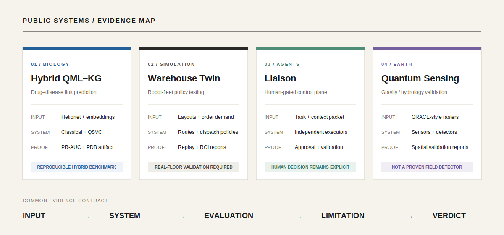
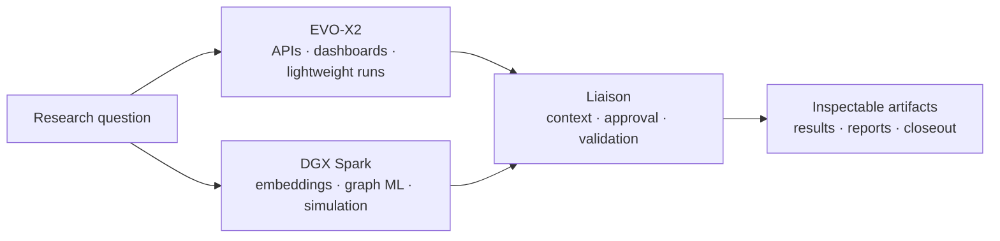

# Jonathan Beale

### Research systems for biology, agent reliability, industrial simulation, and quantum sensing

I build systems that make their own evidence inspectable. A result should lead to a dataset, configuration, benchmark, decision record, structure file, circuit, validation report, or preserved failure.

Every highlighted project below is public.



## Project index

| No. | System | Question | Repository |
| ---: | --- | --- | --- |
| 01 | Hybrid QML–KG | Can biomedical graph evidence rank plausible drug–disease links? | [open repository](https://github.com/iconbaypark2900/hybrid-qml-kg-poc) |
| 02 | Warehouse Digital Twin | Which robot-fleet policy performs best before touching a real floor? | [open repository](https://github.com/iconbaypark2900/warehouse-digital-twin) |
| 03 | Liaison | How should independent AI executors be governed and reviewed? | [open repository](https://github.com/iconbaypark2900/liaison-agentSystem) |
| 04 | Quantum Sensing Earth | Can gravity-derived water-mass data support a reproducible sensing workflow? | [open repository](https://github.com/iconbaypark2900/quantum-sensing-earth) |

---

## 01 / Hybrid QML–KG

**Biomedical link prediction on Hetionet**

```text
Hetionet
→ RotatE embeddings
→ compound–disease features
→ classical models + QSVC
→ stacking ensemble
→ PR-AUC evaluation
→ ranked candidates
```

| Inspect | Evidence |
| --- | --- |
| Problem | Predict missing Compound-treats-Disease links under severe class imbalance |
| Current reproducible best | Ensemble PR-AUC **0.7805** at seed 42 |
| Multi-seed result | **0.7398 ± 0.038** across five seeds |
| Classical baseline | HistGBDT **0.7393 ± 0.037** |\n| Verified quantum benchmark | QSVC **0.7216 PR-AUC** — ZZ 16-qubit full kernel, genuine 908-second single run |
| Structural artifact | CYP19A1 / aromatase PDB used for Anastrozole investigation |
| Verdict | The verified QSVC run approached its corresponding **0.7371** ensemble; the current multi-seed evaluation remains a separate protocol |


[Repository](https://github.com/iconbaypark2900/hybrid-qml-kg-poc) · [Current multi-seed table](https://github.com/iconbaypark2900/hybrid-qml-kg-poc/blob/main/results/multiseed/TABLE3.md) · [Full results evidence](https://github.com/iconbaypark2900/hybrid-qml-kg-poc/blob/main/docs/RESULTS_EVIDENCE.md) · [Architecture](https://github.com/iconbaypark2900/hybrid-qml-kg-poc/blob/main/docs/ARCHITECTURE.md)

---

## 02 / Warehouse Digital Twin

**Decision workbench for robot-fleet policies**

```text
warehouse layout + order demand
→ fleet and dispatch policy
→ route and conflict simulation
→ replay
→ bottleneck and ROI scoring
→ baseline / optimized comparison
→ experiment report
```

| Inspect | Evidence |
| --- | --- |
| Scenario controls | Robot count, speed, demand, zones, racks, lanes, and dispatch policy |
| Policies | Nearest-available, balanced utilization, collision-aware, priority-first, and zone-based |
| Simulation | Order queues, robot paths, traffic, conflicts, reservations, pickups, and deliveries |
| Evaluation | Throughput, backlog, late orders, bottlenecks, goal scoring, and ROI |
| Research workflow | Versioned scenarios, baseline vs. optimized runs, notes, exports, and PDF reports |
| NVIDIA path | Isaac Sim, Replicator, and Isaac Lab export packages |
| Verdict | A policy-testing environment; physical-floor performance still requires real operational validation |

[Repository](https://github.com/iconbaypark2900/warehouse-digital-twin) · [Backend API](https://github.com/iconbaypark2900/warehouse-digital-twin/tree/main/backend) · [Frontend workbench](https://github.com/iconbaypark2900/warehouse-digital-twin/tree/main/frontend)

---

## 03 / Liaison

**Local-first human-in-the-loop agent control plane**

Liaison does not wrap coding agents into one opaque assistant. Claude Code, Codex, OpenCode, Hermes, and research workers remain independent executors. Liaison passes durable context and governs what moves forward.

```bash
liaison init task-001 "One focused goal"
liaison snapshot --show
liaison attach hermes --text "Implementation report"
liaison approve-artifact <outbox-file>
liaison validate --profile python
liaison close-task --summary "Task complete"
```

| Durable artifact | Purpose |
| --- | --- |
| Task brief | Defines one bounded objective |
| Context snapshot | Preserves the state given to an executor |
| Outbox report | Records raw agent output |
| Approval / rejection | Keeps the human decision explicit |
| Validation summary | Connects checks to the produced artifact |
| Closeout record | Preserves result, limitation, and handoff |

[Repository](https://github.com/iconbaypark2900/liaison-agentSystem) · [Integrated operator model](https://github.com/iconbaypark2900/liaison-agentSystem/blob/main/docs/integrated-operator-model.md) · [Architecture](https://github.com/iconbaypark2900/liaison-agentSystem/blob/main/docs/architecture.md)

---

## 04 / Quantum Sensing Earth

**GRACE / GRACE-FO hydrology validation with sensing simulation**

```text
gravity-derived raster
→ provenance-preserving preprocessing
→ sensor simulation
→ detector comparison
→ spatial validation
→ basin and drought comparison
→ review artifacts
```

| Inspect | Evidence |
| --- | --- |
| Inputs | GRACE / GRACE-FO-style gravity grids, CRS, resolution, masks, and manifests |
| Validation | Detector comparison, calibration splits, spatial folds, confidence intervals |
| External context | USDM, GLDAS / TWS, basin summaries, and optional groundwater observations |
| Outputs | HTML report, JSON / CSV results, overlays, metrics, and artifact manifest |
| Scientific limit | Drought proxies are not direct groundwater truth |
| Verdict | Reproducible validation workflow; **not** a proven quantum groundwater detector |

[Repository](https://github.com/iconbaypark2900/quantum-sensing-earth) · [Scientific claims](https://github.com/iconbaypark2900/quantum-sensing-earth/blob/main/docs/SCIENTIFIC_CLAIMS.md) · [Data sources](https://github.com/iconbaypark2900/quantum-sensing-earth/blob/main/docs/DATA_SOURCES.md)

---

## Engineering principles

1. **Artifacts over claims** — expose files, metrics, commands, and outputs.
2. **Baselines before novelty** — classical methods remain visible beside quantum or agentic methods.
3. **Provenance at every boundary** — identify data, model, backend, fallback, and run.
4. **Promotion is a decision** — a successful execution is not automatically a successful experiment.
5. **Failures remain part of the record** — weak results and blocked gates are useful evidence.

## Operating environment



| Workstation | Role |
| --- | --- |
| NVIDIA DGX Spark | Embeddings, graph ML, quantum simulation, digital-twin workloads, and local model serving |
| GMKtec EVO-X2 | APIs, dashboards, orchestration, documentation, and lightweight experiments |
| Liaison | Shared task packets, evidence, validation, approval, and closeout across both systems |

## Core tools

**Languages:** Python, TypeScript, Java, SQL  
**ML / data:** PyTorch, scikit-learn, TensorFlow, NetworkX, PyKEEN  
**Quantum:** Qiskit, PennyLane, CUDA-Q  
**Systems:** FastAPI, Next.js, Docker, PostgreSQL, pgvector, Neo4j, Qdrant  
**Simulation:** NVIDIA Isaac Sim, Omniverse Replicator, Isaac Lab  
**Operations:** GitHub Actions, local model endpoints, DGX Spark, EVO-X2

---

I am interested in research engineering where reproducibility, honest evaluation, and system reliability matter as much as the model.
